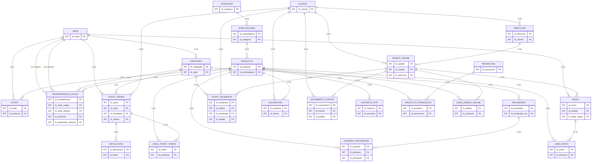

```mermaid
erDiagram
    SEDE ||--o{ EMPLEADO : "(1:N)"
    SEDE ||--o{ STOCK : "(1:N)"
    SEDE ||--o{ TRANSFERENCIA_STOCK : "(1:N origen)"
    SEDE ||--o{ TRANSFERENCIA_STOCK : "(1:N destino)"
    SEDE ||--o{ ENVIO : "(1:N)"
    SEDE ||--o{ TICKET_TIENDA : "(1:N)"

    EMPLEADO ||--o{ PROVEEDOR : "(1:N)"
    EMPLEADO ||--o{ TRANSFERENCIA_STOCK : "(1:N)"
    EMPLEADO ||--o{ TICKET_TIENDA : "(1:N)"
    EMPLEADO ||--o{ TICKET_INCIDENCIA : "(1:N)"

    CLIENTE ||--o{ DIRECCION : "(1:N)"
    CLIENTE ||--o{ PEDIDO_ONLINE : "(1:N)"
    CLIENTE ||--o{ TICKET_TIENDA : "(1:N)"
    CLIENTE ||--o{ TICKET_INCIDENCIA : "(1:N)"
    CLIENTE ||--o{ VALORACION : "(1:N)"
    CLIENTE ||--o{ MOVIMIENTO_PUNTOS : "(1:N)"

    DIRECCION ||--o{ PEDIDO_ONLINE : "(1:N)"

    CATEGORIA ||--o{ SUBCATEGORIA : "(1:N)"
    SUBCATEGORIA ||--o{ PRODUCTO : "(1:N)"

    PRODUCTO ||--o{ HISTORICO_PVP : "(1:N)"
    PRODUCTO ||--o{ PRODUCTO_PROMOCION : "(1:N)"
    PRODUCTO ||--o{ ACUERDO_PROVEEDOR : "(1:N)"
    PRODUCTO ||--o{ STOCK : "(1:N)"
    PRODUCTO ||--o{ TRANSFERENCIA_STOCK : "(1:N)"
    PRODUCTO ||--o{ LINEA_PEDIDO_ONLINE : "(1:N)"
    PRODUCTO ||--o{ LINEA_ENVIO : "(1:N)"
    PRODUCTO ||--o{ LINEA_TICKET_TIENDA : "(1:N)"
    PRODUCTO ||--o{ VALORACION : "(1:N)"

    PROMOCION ||--o{ PRODUCTO_PROMOCION : "(1:N)"

    PROVEEDOR ||--o{ ACUERDO_PROVEEDOR : "(1:N)"

    PEDIDO_ONLINE ||--o{ LINEA_PEDIDO_ONLINE : "(1:N)"
    PEDIDO_ONLINE ||--o{ ENVIO : "(1:N)"
    PEDIDO_ONLINE ||--o{ TICKET_INCIDENCIA : "(1:N)"
    PEDIDO_ONLINE ||--o{ MOVIMIENTO_PUNTOS : "(1:N)"

    ENVIO ||--o{ LINEA_ENVIO : "(1:N)"

    TICKET_TIENDA ||--o{ LINEA_TICKET_TIENDA : "(1:N)"
    TICKET_TIENDA ||--o{ DEVOLUCION : "(1:N)"

    SEDE {
        INT id_sede PK
    }

    EMPLEADO {
        INT id_empleado PK
        INT id_sede FK
    }

    CLIENTE {
        INT id_cliente PK
    }

    DIRECCION {
        INT id_direccion PK
        INT id_cliente FK
    }

    CATEGORIA {
        INT id_categoria PK
    }

    SUBCATEGORIA {
        INT id_subcategoria PK
        INT id_categoria FK
    }

    PRODUCTO {
        INT id_producto PK
        INT id_subcategoria FK
    }

    HISTORICO_PVP {
        INT id_historico PK
        INT id_producto FK
    }

    PROMOCION {
        INT id_promocion PK
    }

    PRODUCTO_PROMOCION {
        INT id_producto FK
        INT id_promocion FK
    }

    PROVEEDOR {
        INT id_proveedor PK
        INT id_empleado_rep FK
    }

    ACUERDO_PROVEEDOR {
        INT id_acuerdo PK
        INT id_producto FK
        INT id_proveedor FK
    }

    STOCK {
        INT id_sede FK
        INT id_producto FK
    }

    TRANSFERENCIA_STOCK {
        INT id_transferencia PK
        INT id_sede_origen FK
        INT id_sede_destino FK
        INT id_producto FK
        INT id_empleado_autoriza FK
    }

    PEDIDO_ONLINE {
        INT id_pedido PK
        INT id_cliente FK
        INT id_direccion FK
    }

    LINEA_PEDIDO_ONLINE {
        INT id_pedido FK
        INT id_producto FK
    }

    ENVIO {
        INT id_envio PK
        INT id_pedido FK
        INT id_sede_origen FK
    }

    LINEA_ENVIO {
        INT id_envio FK
        INT id_producto FK
    }

    TICKET_TIENDA {
        INT id_ticket PK
        INT id_sede FK
        INT id_empleado FK
        INT id_cliente FK
    }

    LINEA_TICKET_TIENDA {
        INT id_ticket FK
        INT id_producto FK
    }

    DEVOLUCION {
        INT id_devolucion PK
        INT id_ticket FK
    }

    TICKET_INCIDENCIA {
        INT id_incidencia PK
        INT id_cliente FK
        INT id_empleado FK
        INT id_pedido FK
    }

    VALORACION {
        INT id_producto FK
        INT id_cliente FK
    }

    MOVIMIENTO_PUNTOS {
        INT id_movimiento PK
        INT id_cliente FK
        INT id_pedido FK
    }
```