```markdown
# Proyecto de Base de Datos:
## Base de Datos para NexShop Group S.A.

# Realizado por:
## Samuel Jiménez Motos

# Descripción del proyecto:
Este proyecto consiste en el análisis, diseño e implementación desde cero de una base de datos relacional orientada a la gestión de una tienda que vende tanto por canal físico como online. La arquitectura desarrollada da soporte completo al control logístico descentralizado de stock, la diferenciación operativa entre los canales de ventas físicos y online, el seguimiento de variaciones en el catálogo de precios y promociones, la auditoría de acuerdos comerciales con proveedores, la trazabilidad de incidencias de soporte técnico y la contabilidad transparente de un programa de puntos de fidelización para clientes.

# Explicación de la empresa modelada:
NexShop Group S.A. es una empresa ficticia dedicada a la distribución y venta al por menor que fue fundada en el año 2015 con su sede principal ubicada en Valencia. La organización opera en el mercado mediante dos canales de venta bien diferenciados: una plataforma de venta online a través de internet (digamos nexshop.es) y una red logística presencial de tres tiendas físicas ubicadas estratégicamente en las ciudades de Valencia, Madrid y Barcelona.

# Diagrama Entidad-Relación (ER):
El siguiente diagrama describe la totalidad de las veinticuatro entidades del sistema con sus correspondientes claves primarias y foráneas, aplicando una notación limpia que explicita las cardinalidades relacionales requeridas.

```mermaid
erDiagram
    SEDE ||--o{ EMPLEADO : "(1:N)"
    SEDE ||--o{ STOCK : "(1:N)"
    SEDE ||--o{ TRANSFERENCIA_STOCK : "(1:N origen)"
    SEDE ||--o{ TRANSFERENCIA_STOCK : "(1:N destino)"
    SEDE ||--o{ ENVIO : "(1:N)"
    SEDE ||--o{ TICKET_TIENDA : "(1:N)"

    EMPLEADO ||--o{ PROVEEDOR : "(1:N)"
    EMPLEADO ||--o{ TRANSFERENCIA_STOCK : "(1:N)"
    EMPLEADO ||--o{ TICKET_TIENDA : "(1:N)"
    EMPLEADO ||--o{ TICKET_INCIDENCIA : "(1:N)"

    CLIENTE ||--o{ DIRECCION : "(1:N)"
    CLIENTE ||--o{ PEDIDO_ONLINE : "(1:N)"
    CLIENTE ||--o{ TICKET_TIENDA : "(1:N)"
    CLIENTE ||--o{ TICKET_INCIDENCIA : "(1:N)"
    CLIENTE ||--o{ VALORACION : "(1:N)"
    CLIENTE ||--o{ MOVIMIENTO_PUNTOS : "(1:N)"

    DIRECCION ||--o{ PEDIDO_ONLINE : "(1:N)"

    CATEGORIA ||--o{ SUBCATEGORIA : "(1:N)"
    SUBCATEGORIA ||--o{ PRODUCTO : "(1:N)"

    PRODUCTO ||--o{ HISTORICO_PVP : "(1:N)"
    PRODUCTO ||--o{ PRODUCTO_PROMOCION : "(1:N)"
    PRODUCTO ||--o{ ACUERDO_PROVEEDOR : "(1:N)"
    PRODUCTO ||--o{ STOCK : "(1:N)"
    PRODUCTO ||--o{ TRANSFERENCIA_STOCK : "(1:N)"
    PRODUCTO ||--o{ LINEA_PEDIDO_ONLINE : "(1:N)"
    PRODUCTO ||--o{ LINEA_ENVIO : "(1:N)"
    PRODUCTO ||--o{ LINEA_TICKET_TIENDA : "(1:N)"
    PRODUCTO ||--o{ VALORACION : "(1:N)"

    PROMOCION ||--o{ PRODUCTO_PROMOCION : "(1:N)"

    PROVEEDOR ||--o{ ACUERDO_PROVEEDOR : "(1:N)"

    PEDIDO_ONLINE ||--o{ LINEA_PEDIDO_ONLINE : "(1:N)"
    PEDIDO_ONLINE ||--o{ ENVIO : "(1:N)"
    PEDIDO_ONLINE ||--o{ TICKET_INCIDENCIA : "(1:N)"
    PEDIDO_ONLINE ||--o{ MOVIMIENTO_PUNTOS : "(1:N)"

    ENVIO ||--o{ LINEA_ENVIO : "(1:N)"

    TICKET_TIENDA ||--o{ LINEA_TICKET_TIENDA : "(1:N)"
    TICKET_TIENDA ||--o{ DEVOLUCION : "(1:N)"

    SEDE {
        INT id_sede PK
        VARCHAR nombre
        ENUM tipo
        VARCHAR ciudad
    }

    EMPLEADO {
        INT id_empleado PK
        VARCHAR dni
        VARCHAR nombre
        VARCHAR email_corporativo
        DATE fecha_incorporacion
        ENUM cargo
        INT id_sede FK
    }

    CLIENTE {
        INT id_cliente PK
        VARCHAR nombre
        VARCHAR apellidos
        VARCHAR email
        VARCHAR contrasena
        DATE fecha_nac
    }

    DIRECCION {
        INT id_direccion PK
        INT id_cliente FK
        ENUM tipo_direccion
        VARCHAR calle
        VARCHAR numero
        VARCHAR bloque
        VARCHAR planta
        VARCHAR puerta
        VARCHAR cp
        VARCHAR ciudad
        VARCHAR pais
    }

    CATEGORIA {
        INT id_categoria PK
        VARCHAR nombre
    }

    SUBCATEGORIA {
        INT id_subcategoria PK
        INT id_categoria FK
        VARCHAR nombre
    }

    PRODUCTO {
        INT id_producto PK
        INT id_subcategoria FK
        VARCHAR nombre
    }

    HISTORICO_PVP {
        INT id_historico PK
        INT id_producto FK
        DECIMAL pvp
        DATETIME fecha_inicio
        DATETIME fecha_fin
    }

    PROMOCION {
        INT id_promocion PK
        VARCHAR nombre
        DECIMAL descuento_pct
        DATETIME fecha_inicio
        DATETIME fecha_fin
    }

    PRODUCTO_PROMOCION {
        INT id_producto PK,FK
        INT id_promocion PK,FK
    }

    PROVEEDOR {
        INT id_proveedor PK
        VARCHAR nombre
        INT id_empleado_rep FK
    }

    ACUERDO_PROVEEDOR {
        INT id_acuerdo PK
        INT id_producto FK
        INT id_proveedor FK
        DECIMAL precio_coste
        SMALLINT plazo_entrega_dias
        DATE fecha_inicio
        DATE fecha_fin
    }

    STOCK {
        INT id_sede PK,FK
        INT id_producto PK,FK
        MEDIUMINT cantidad
    }

    TRANSFERENCIA_STOCK {
        INT id_transferencia PK
        DATETIME fecha
        INT id_sede_origen FK
        INT id_sede_destino FK
        INT id_producto FK
        MEDIUMINT cantidad
        INT id_empleado_autoriza FK
    }

    PEDIDO_ONLINE {
        INT id_pedido PK
        INT id_cliente FK
        INT id_direccion FK
        DATETIME fecha
    }

    LINEA_PEDIDO_ONLINE {
        INT id_pedido PK,FK
        INT id_producto PK,FK
        SMALLINT cantidad
        DECIMAL precio_unitario
    }

    ENVIO {
        INT id_envio PK
        INT id_pedido FK
        INT id_sede_origen FK
        VARCHAR num_seguimiento
        VARCHAR transportista
        DATE fecha_estimada
    }

    LINEA_ENVIO {
        INT id_envio PK,FK
        INT id_producto PK,FK
        SMALLINT cantidad
    }

    TICKET_TIENDA {
        INT id_ticket PK
        INT id_sede FK
        INT id_empleado FK
        INT id_cliente FK
        DATETIME fecha
    }

    LINEA_TICKET_TIENDA {
        INT id_ticket PK,FK
        INT id_producto PK,FK
        SMALLINT cantidad
        DECIMAL precio_unitario
    }

    DEVOLUCION {
        INT id_devolucion PK
        INT id_ticket FK
        DATETIME fecha
    }

    TICKET_INCIDENCIA {
        INT id_incidencia PK
        INT id_cliente FK
        VARCHAR asunto
        TEXT descripcion
        DATETIME fecha_apertura
        ENUM estado
        INT id_empleado FK
        INT id_pedido FK
        DATETIME fecha_cierre
        TEXT nota_resolucion
    }

    VALORACION {
        INT id_producto PK,FK
        INT id_cliente PK,FK
        TINYINT puntuacion
        TEXT comentario
        BOOLEAN compra_verificada
    }

    MOVIMIENTO_PUNTOS {
        INT id_movimiento PK
        INT id_cliente FK
        DATETIME fecha
        INT id_pedido FK
        MEDIUMINT cantidad
        ENUM tipo
    }
```


